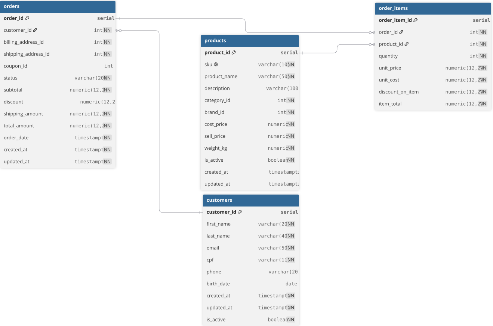

# projeto-eccomerce
Nesse projeto, resolvo alguns problemas de negócio e faço algumas análises para melhorar a performance de uma empresa inserida no eccomerce

# Contexto e visão do projeto
A Ecommerce 360 é uma empresa de comércio online especializada na venda de produtos e acessórios esportivos para clientes de diferentes regiões do Brasil. Sua operação integra vendas, pagamentos, entregas, estoques e relacionamento com fornecedores, gerando dados que podem apoiar decisões comerciais e operacionais.
Com o crescimento da operação da empresa, foi necessário juntar essas informações em uma visão analítica, acompanhando o desempenho da empresa, identificar oportunidades de crescimento e antecipar **riscos** relacionados à **rentabilidade**, **experiência do cliente** e à **disponibilidade de produtos**.
Este projeto analisa os dados da Ecommerce360 entre janeiro de 2024 e agosto de 2026. A base reúne 240 pedidos, 600 itens vendidos, 50 clientes, 40 produtos, 8 categorias, 10 marcas, 3 centros de distribuição e 6 fornecedores.
# O objetivo do projeto
O objetivo aqui é transformar esses dados em informações úteis para apoiar decisões relacionadas a:
* evolução das vendas, do ticket médio e da margem bruta;
* desempenho de produtos, categorias e marcas;
* comportamento, recorrência e distribuição geográfica dos clientes;
* utilização de cupons e desempenho das formas de pagamento;
* satisfação dos clientes, devoluções e cancelamentos;
* cobertura de estoque, necessidade de reposição e dependência de fornecedores.

O banco de dados, assim como todos os registros dentro dele, foram desenvolvidos por mim.

Você pode acessar todos os scripts [aqui](./scripts/sql/).

Você pode acessar os dashboards desenvolvidos [aqui](./dashboards/).

# Estrutura do banco de dados
O banco de dados é composto por 18 tabelas, relacionadas entre si, abrangendo:
* clientes
* pedidos
* produtos
* pagamentos
* entregas
* estoque
* fornecedores

Você pode ver o diagrama ERD completo [aqui](./imagens/diagrama_erd.svg).

A estrutura foi desenvolvida para integrar áreas diferentes dentro da operação, usando chaves primárias e estrangeiras para preservar a consistência. O banco possui 20 relacionamentos, permitindo acompanhar toda a jornada de um pedido de venda, desde o cadastro do cliente até a entrega ou eventual cancelamento ou devolução.

O principal relacionamento aqui é entre as tabelas customers, orders, order_items e products, permitindo um cliente realizar vários pedidos, e cada pedido podendo conter diversos itens, que estarão associados a um produto.

  

