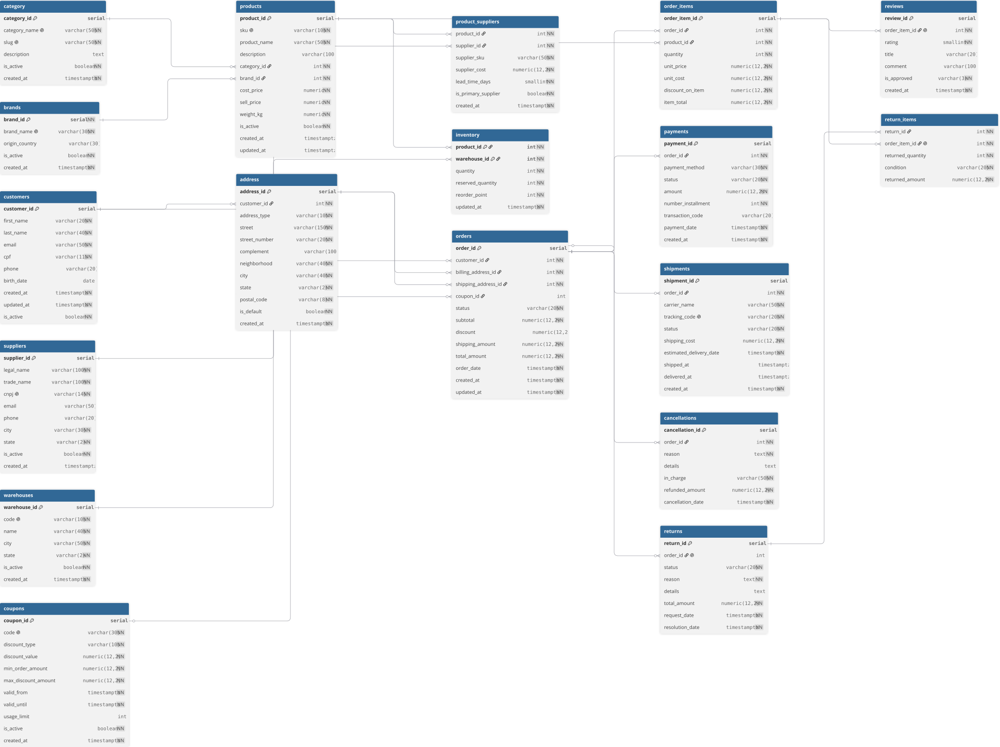
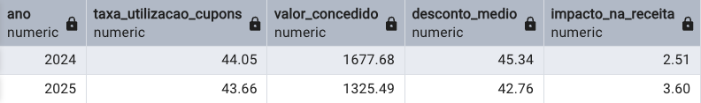

# Projeto Ecommerce360 - Análise de queda de receita
Análise desenvolvida para identificar fatores associados à queda da receita da empresa Ecommerce360 entre 2024 e 2025.

Meu objetivo aqui é entregar insights e recomendações que ajudarão a empresa na definição de novas estratégias, **demonstrando domínio em análises de negócios**, **uso de IA para otimização no trabalho**, e **skills necessárias para o cargo de Analista de Dados**.

# ‼️OBS

Antes de iniciar a leitura, quero deixar claro que utilizei IA como ferramenta de apoio na construção e revisão de consultas SQL nesse projeto. 

Acredito que o uso de IA pode contribuir de forma positiva para a agilidade e para o desenvolvimento do trabalho de um analista de dados, desde que seja utilizada como uma ferramenta, e não como o senso crítico. 

Não utilizei a ferramenta para substituir meu raciocínio ou a interpretação de análises. 

# Sumário
* [Visão geral do projeto](#visao-geral-do-projeto)
* [Estrutura de dados](#estrutura-de-dados)
* [Resumo executivo](#resumo-executivo)
* [Aprofundamento das análises](#aprofundamento-das-analises)
* [Minhas recomendações](#minhas-recomendacoes)
* [Limitações](#limitacoes)
* [Ferramentas utilizadas](#ferramentas-utilizadas)

# Visão geral do projeto
A Ecommerce360 é uma empresa de comércio online especializada na venda de produtos e acessórios esportivos para clientes de diferentes regiões do Brasil.

Sua operação integra vendas, pagamentos, entregas, estoques e relacionamento com fornecedores. Esses processos geram dados que podem ser utilizados para acompanhar o desempenho comercial, identificar oportunidades de crescimento e antecipar riscos relacionados à receita, à experiência do cliente e à disponibilidade de produtos.

**Objetivo comercial:**
O objetivo desse projeto é **explicar a queda da receita da empresa no ano de 2025**, e entregar insights para apoiar a tomada de decisão da diretoria.

Os seguintes pontos foram avaliados:

* Evolução mensal da receita;
* Quantidade de pedidos entregues;
* Quantidade de unidades vendidas;
* Tamanho médio da cesta;
* Valor médio por unidade;
* Desempenho de produtos e marcas;
* Utilização de cupons e descontos;
* Cancelamentos de pedidos;
* Devoluções e reembolsos.

O banco de dados, assim como a carga de dados nele, foram desenvolvidos por mim apenas para esse projeto específico.

**A documentação técnica e os códigos utilizados nas análises estão [aqui](./scripts_sql/).**

# Estrutura dos dados

A base traz dados entre janeiro de 2024 e agosto de 2026. A análise levará em conta apenas os anos de 2024 e 2025, pois 2026 não contém dados suficientes para isso.

**Escopo:**

O banco é composto por 18 tabelas relacionadas, trazendo dados sobre:
* clientes e endereços;
* pedidos e itens vendidos;
* produtos, categorias e marcas;
* pagamentos;
* entregas;
* estoques e centros de distribuição;
* fornecedores;
* cupons e descontos;
* cancelamentos;
* devoluções e avaliações.

**Diagrama completo do banco de dados:**

  

  <em>Diagrama completo da estrutura do banco de dados.</em>

O relacionamento central da operação ocorre entre as tabelas customers, orders, order_items e products.

Um cliente pode realizar vários pedidos. Cada pedido pode conter diversos itens, e cada item está associado a um produto do catálogo.

  

  <em>Relacionamento central utilizado nas análises comerciais.</em>

# Resumo executivo:

A receita dos **pedidos entregues** caiu **45,5%**, passando de **R$65.131,03 em 2024**, para **R$35.526,58 em 2025**. A queda foi analisada de forma detalhada nesse projeto, deixando em evidência:
* redução de 15,5% na quantidade de pedidos entregues;
* diminuição de 34,3% no tamanho médio das cestas (principal motivo para a queda na receita, conforme análises).
* taxa de cancelamento subiu de 0,83% em 2024 para 8,77% em 2025.

<!--
print do dashboard quando estiver pronto

  

  <em>Visão executiva dos principais indicadores de 2024 e 2025.</em>

-->

# Aprofundamento das análises
## Evolução da receita:

Considerei receita apenas pedidos entregues (status "delivered").

**Ano de 2024**: Receita de R$65.131,03.

**Ano de 2025**: Receita de R$35.526,54 --> queda de 45,5% em relação à 2024, ou seja, **R$29.604,45**.

A comparação mensal mostrou que a receita de 2025 ficou abaixo da de 2024 em todos os meses. Isso descartou a hipótese da redução ter sido causada por um único evento ou mês, mas sim por um resultado inferior ao longo do ano todo.

Consulte os códigos utilizados nesta análise [aqui](../scripts_sql).

## Quantidade de pedidos entregues:

**Ano de 2024:** 84 pedidos entregues.

**Ano de 2025:** 71 pedidos entregues. (Variação de 15%, quando comparado à 2024).

Claramente, essa redução contribuiu para a perda de receita, mas não foi algo extremamente prejudicial, como a queda de 45,5% no faturamento. **Isso descarta a hipótese de que a quantidade de pedidos foi a única culpada para o resultado ruim em 2025**.

Além de gerar menos pedidos, a empresa também passou a gerar menos receita em cada compra, que é a razão da próxima análise.

## Quantidade de itens em cada pedido:

**Ano de 2024:** Média de de 5,98 itens por pedido.

**Ano de 2025:** Média de 3,93 itens por pedido. (Variação de 34,3% em relação à 2024.)

A análise de quantidade de itens em cada pedido nos dois anos, até aqui, é a que mais se associa com a queda na receita. Uma queda de 34,3% na quantidade média de pedidos por cesta traz um ticket médio menor, impactando diretamente no faturamento.

  

  <em>Comparação do tamanho médio das cestas em 2024 e 2025.</em>

Consulte o código SQL utilizado nesta análise [aqui](../scripts_sql).

## Valor médio por unidade vendida:

**Ano de 2024:** Valor média de R$132,84 por unidade.

**Ano de 2025:** Valor médio de R$129,37 por unidade. (Variação de 2,6%.)

A variação no valor médio por unidade foi considerada pequena, e praticamente irrelevante, quando comparada com a queda de 34% no tamanho das cestas.

A escolha de produtos mais baratos pode ter contribuído para o resultado ruim, mas não foi o principal fator.

## Desempenho de produtos:

**Ano de 2024:** 502 unidades vendidas.

**Ano de 2025:** 279 unidades vendidas.

Dos 40 produtos, 37 perderam receita e apenas 3 apresentaram crescimento.

Os 5 produtos com a maior perda em receita, concentraram **38,56% da redução na receita dos itens.**

Os produtos que apresentaram as maiores perdas foram:

* Mini Gol Dobrável, com 18 unidades vendidas em 2024 e 7 em 2025 --> Redução de R$3.628,90 na receita.
* Tênis de Corrida Sprint, com 14 unidades vendidas em 2024 e 7 em 2025 --> Redução de R$2.449,30 na receita.
* Capacete Ciclismo Urban, com 14 unidades vendidas em 2024 e 4 em 2025 --> Redução de R$2.299,00.
* Tênis de Basquete Jump, com 10 unidades vendidas em 2024 e 6 em 2025 --> Redução de R$1.719,60.
* Óculos Ciclismo Road, com 15 unidades vendidas em 2024 e 5 em 2025 --> Redução de R$1.699,00.

Os valores médios desses produtos praticamente não mudou nesses dois anos, mostrando que a perda de receita aconteceu principalmente porque menos unidades deles foram vendidas, **descartando a redução dos preços como causa para receita baixa**.

**🚨Insight** --> Os 5 produtos apresentados devem receber atenção prioritária, justamente porque concentram uma parcela grande na perda de receita.

## Desempenho das marcas:

Todas as 10 marcas analisadas perderam receita em 2025. Porém, **4 delas concentraram 64,2% da redução da receita dos itens**.

* Puma: redução de R$5.925,43; --> maior impacto, com **redução de 64,8% nas unidades vendidas.**
* Penalty: redução de R$4.896,28;
* Adidas: redução de R$4.748,22;
* Nike: redução de R$4.073,67.

**🚨Insight** --> Os resultados mostraram que a queda foi generalizada, mas também que **a recuperação dessas marcas é prioridade**, por concentrarem uma grande participação na receita perdida.

Consulte os códigos utilizados para essa análise [aqui](../scripts_sql).

## Utilização de cupons e descontos:

A taxa de utilização de cupons permaneceu praticamente estável, passando de 44,05% para 43,66%.

Os resultados não indicaram que a política de descontos tenha sido um dos fatores responsáveis pela queda.

  

  <em>Comparação da utilização de cupons em 2024 e 2025.</em>

## Cancelamentos:

**Ano de 2024:** 1 cancelamento em 121 pedidos, com taxa de 0,83%.

**Ano de 2025:** 10 cancelamentos em 114 pedidos, com taxa de 8,77%.

A quantidade de cancelamentos aumentou de 1 para 10 pedidos, e o valor associado aos cancelamentos aumentou em **R$5.471,88**, chegando a R$6.436,28 em 2025.

Esse comportamento mostra uma piora relevante no desempenho. Enquanto menos de 1 em cada 100 pedidos foi cancelado em 2024, aproximadamente 1 em cada 11 pedidos foi cancelado em 2025.

**🚨Insight** --> Os cancelamentos se tornaram um dos principais motivos para a redução na receita, e devem ser investigados com maior profundidade, principalmente em relação aos motivos que causaram a desistência de clientes ou indisponibilidade de produtos.

Também lembrando que você pode acessar as recomendações dadas por mim [aqui](#minhas-recomendacoes).

## Reembolsos:

**Ano de 2024:** 6 pedidos reembolsados, com uma taxa de 7,14% e impacto de 1,11% na receita.

**Ano de 2025:** 5 pedidos reembolsados, com uma taxa de 7,04% e impacto de 1,93% na receita.

A análise mostrou que a taxa de reembolso permaneceu estável. O valor também foi semelhante e apresentou uma pequena redução em 2025.

Os reembolsos não foram identificados como um fator relevante para a queda da receita.

# Minhas recomendações

## (Ação prioritária) Recuperar o tamanho médio das cestas:

🚨 A redução de 34,3% nas unidades por pedido foi o principal motivo para a queda na receita identificado no projeto.

**Algumas estratégias que a empresa pode adotar são:**

* Criação de kits de produtos que se complementam;
* Recomendações de itens por parte dos vendedores, na hora da venda;
* Descontos progressivos, sem atacar a margem da empresa;
* Frete gratuito a partir de certo valor de pedido;
* Treinamento específico para a equipe de vendedores.

## Priorizar produtos e marcas com maior perda:

Puma, Penalty, Adidas e Nike foram responsáveis por 64,2% da redução da receita entre as marcas.

**Algumas estratégias que a empresa pode adotar são:**

* Revisar exposição dessas marcas de forma estratégica nos canais de venda;
* Avaliar campanhas direcionada para as marcas que tiveram essa maior queda;
* Criar combinações entre produtos de alta demanda e itens complementares dessas marcas.

## Toque humano no pós venda:

Com esse dataset, não temos acesso aos motivos específicos de cancelamento de pedidos, mas um motivo frequente para esse tópico é a falta da qualidade no pós-venda, realmente conversando com o cliente, enviando mensagens de "boas vindas", "parabéns pela compra", etc. Isso realmente faz o cliente se sentir em casa, e pode diminuir a taxa de cancelamentos.

## Considerações

Todas as análises e recomendações permitirão identificar desvios com antecedência e apoiar **decisões mais rápidas da diretoria**.

As áreas comercial e marketing, podem utilizar os resultados desta análise para definir estratégias, e principalmente, testar diferentes resoluções para o problema da queda de receita.

# Limitações

* A base utilizada é fictícia e foi criada para simular a operação de uma empresa de comércio eletrônico;
* A análise utiliza apenas 2024 e 2025 como base, pois 2026 não possui dados suficientes para análises;
* A base tem apenas 240 pedidos, o que limita a generalização dos resultados para operações de maior escala;
* As análises mostram a relação entre indicadores, mas não é possível garantir, com esse dataset uma relação de causa e efeito;
* O histórico de entrada e saída de produtos do catálogo não está disponível. Com isso eu não consegui confirmar quais produtos estavam formalmente ativos em cada período;

# Ferramentas utilizadas

* **PostgreSQL**: consultas, tratamento e análise de dados;
* **Excel**: validação dos resultados, análises complementares, e alguns prints de gráficos rápidos;
* **GitHub:** documentação e versionamento do projeto.

# Documentação técnica

Os recursos técnicos do projeto estão disponíveis nos diretórios:

* [scripts_sql](../scripts_sql)
* [imagens](../imagens)
